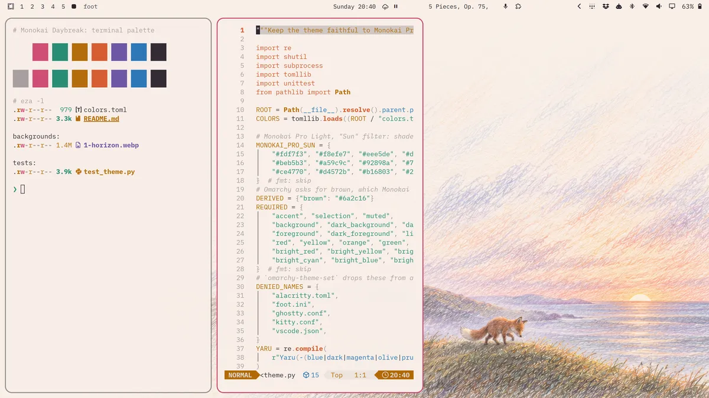

# Monokai Daybreak for Omarchy



Monokai Daybreak is an unofficial light Omarchy theme, installed as
`monokai-daybreak`. It uses the [Monokai Pro](https://monokai.pro/) Light
palette with the "Sun" filter, and is the light twin of
[Monokai Nightfall](https://github.com/krosdai/omarchy-monokai-nightfall-theme):
the same fox watches the sun set in one and rise in the other. Omarchy uses
only its colours, wallpapers and icon setting. The repository also carries its
Python tests, but nothing runs them when you install or apply the theme.

| Role | Colours |
|------|---------|
| Shades, lightest to darkest | `#fdf7f3` `#f8efe7` `#eee5de` `#ded5d0` `#d2c9c4` `#beb5b3` `#a59c9c` `#92898a` `#72696d` `#2c232e` |
| Accents | red `#ce4770`, orange `#d4572b`, yellow `#b16803`, green `#218871`, blue `#2473b6`, purple `#6851a2` |

Omarchy generates every app's configuration from `colors.toml`: terminals,
Hyprland, the shell, btop, Chromium, Neovim, Helix, VS Code and others. Three
mappings are deliberate:

- Following the official Sun terminal palette, the ANSI blue slot is orange,
  the cyan slot is Sun's blue, and the bright colours repeat the normal
  accents.
- The UI accent is red `#ce4770`, as in Monokai Pro Light, where yellow would
  be too faint on light paper. File-manager icons use `Yaru-red`.
- Omarchy also asks for a brown, which Monokai Pro does not have. It is orange
  mixed 50% with black (`#6a2c16`).

## Install

Review this repository, then run:

```sh
omarchy theme install https://github.com/krosdai/omarchy-monokai-daybreak-theme.git
```

Or use _Install > Style > Theme_ in the Omarchy menu. Omarchy removes the
`omarchy-` prefix and `-theme` suffix from the repository name, so the theme
appears as `monokai-daybreak`. Installing it also activates it. Update with
`omarchy theme update` and switch themes with the usual picker. An Omarchy
theme has a single light or dark mode, so install Monokai Nightfall as well if
you want to switch between the pair.

The theme ships no Lua, terminal configs or `vscode.json`. Omarchy would drop
those from a cloned theme anyway, and generates them from the palette instead.
For VS Code or Neovim, the generated themes follow this palette. To use the
official Monokai Pro editor themes, install them yourself.

## Uninstall

Switch to another theme first, then run:

```sh
omarchy theme remove monokai-daybreak
```

This deletes `~/.config/omarchy/themes/monokai-daybreak` and nothing else.

## Development

```sh
python -m unittest discover -s tests -v
uvx ruff check .
uvx ruff format --check .
```

The tests check that the palette is complete, light and uses only Monokai Pro
Light "Sun" colours, and that the repository contains nothing an installed
theme would drop. When Omarchy is installed, they also resolve the palette with
`omarchy-theme-color`, which only reads. Do not switch your desktop theme to
run the tests.

The horizon wallpaper, `2-horizon.webp`, was generated with Codex image
generation from the palette above, as one low-contrast picture around a
rose-mist `#ead9d2`. Its colours were then adjusted with ImageMagick so the sky
sits exactly on that tone, and the scene was blended into a flat `#ead9d2`
outside the area Nightfall's horizon covers, so it runs seamlessly behind the
cream windows. The default wallpaper, `1-kite.webp`, shows the robot Pululu
flying a leaf kite at sunrise with the flame spirit Spark riding on it. It was
drawn at 2560×1440 with OpenAI's `gpt-image-2` from an earlier Codex scene,
colour-matched to Nightfall's grove palette, blended into the same flat
`#ead9d2` and placed at its native size on a 3840×2160 sheet of that colour, so
the scene stays sharp and small. Monokai Daybreak is not affiliated with or endorsed by Monokai, the
maker of Monokai Pro.
